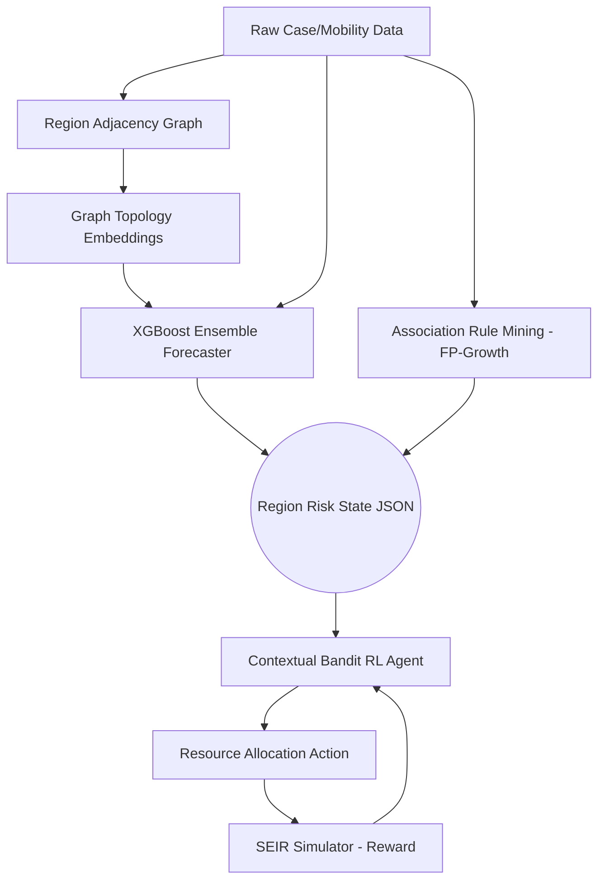

# EpiGraphML: Disease Outbreak Prediction & Resource Allocation System


**EpiGraphML** is an advanced epidemiological intelligence system that bridges the gap between predictive disease forecasting and actionable policy simulation. By combining Graph Representation Learning (GNNs/Spectral Embeddings), Ensemble Forecasters, Association Rule Mining, and Contextual Reinforcement Learning within a simulated SEIR environment, EpiGraphML allocates medical resources (testing kits, vaccines, staff) dynamically to curb outbreak surges.

---

## 🏗️ System Architecture

EpiGraphML operates on a dual-persona paradigm: 
* **Persona A (Data & Predictive Graph-ML)**: Collects district-level demographic, health, and case data, generates mobility embeddings, and forecasts cases alongside actionable risk scores and surge explanations.
* **Persona B (RL, Simulation & Systems)**: Consumes the risk pipeline to power a contextual bandit reinforcement learning agent. The agent allocates resources, which are then validated against a custom SEIR epidemic simulator for reward calculation.

### Pipeline Flow


---

## 🛠️ Technology Stack

* **Data Engineering**: `pandas`, `requests`
* **Graph Modeling**: `networkx` (Watts-Strogatz synthetic mobility topology), `numpy` (Normalized Laplacian Spectral Embedding fallback due to PyTorch environment restrictions).
* **Forecasting**: `xgboost` (Primary Forecaster), custom pure-NumPy Multi-Layer Perceptron (MLP Baseline).
* **Rule Mining**: `mlxtend` (Apriori/FP-Growth).
* **Data Contract**: Standardized strict JSON schemas decoupling the ML prediction engine from the RL simulation engine.

---

## 📂 Repository Structure

```text
epigraphml/
├── data/
│   ├── raw/                  # (Ignored) Raw downloaded CSVs
│   └── processed/            # Cleaned data, demographics, region_graph.json, gnn_embeddings.json
├── graph/
│   ├── build_graph.py        # Generates synthetic/real spatial mobility networks
│   └── gnn_model.py          # Extracts 16-D topological embeddings (Spectral Laplacian)
├── forecasting/
│   ├── ensemble_model.py     # XGBoost forecaster utilizing graph embeddings & lag features
│   └── mlp_baseline.py       # Pure NumPy MLP for evaluation baseline comparison
├── rules/
│   └── association_mining.py # FP-Growth mining of factors leading to outbreaks
├── rl/                       # (Persona B scope - Under Development)
│   ├── seir_simulator.py     # Custom NumPy SEIR environment for reward evaluation
│   └── bandit_agent.py       # Contextual bandit for resource distribution
├── api/                      # FastAPI Backend
├── dashboard/                # Frontend Analytics
├── export_risk.py            # Aggregates Persona A models into region_risk_output.json
├── evaluation.md             # Model benchmarking (XGBoost vs MLP)
└── region_risk_output.json   # 🔥 The primary data contract consumed by the RL agent
```

---

## 🚀 Getting Started (Persona A Pipeline)

### 1. Installation

Ensure you have Python 3.10+ installed.

```bash
pip install pandas numpy networkx xgboost mlxtend requests
```

*(Note: PyTorch and Scikit-Learn are not required for this iteration as custom pure-NumPy implementations are utilized to bypass local Application Control policies).*

### 2. Running the Predictive Pipeline

Run the modules sequentially to gather data, embed the graph, train forecasters, mine rules, and export the RL state.

```bash
# 1. Fetch district data from Covid19India APIs (Aug-Oct 2021)
python data/fetch_and_clean.py

# 2. Construct the regional mobility/adjacency network
python graph/build_graph.py

# 3. Generate 16-D Graph Topological Embeddings 
python graph/gnn_model.py

# 4. Train the XGBoost Ensemble Forecaster
python forecasting/ensemble_model.py

# 5. Train the MLP Baseline (for comparison)
python forecasting/mlp_baseline.py

# 6. Mine Explanatory Association Rules
python rules/association_mining.py

# 7. Aggregate and Export the Data Contract for Persona B
python export_risk.py
```

### 3. Exploring the Output

The culmination of the predictive pipeline is the `region_risk_output.json`. This file strictly adheres to the data contract established between the ML team and the RL team. 

```json
{
  "timestep": "2026-09-01",
  "regions": [
    {
      "region_id": "TN-CHE",
      "risk_score": 0.3729,
      "predicted_cases": 96,
      "embedding": [0.1306, -0.0365, ...],
      "contributing_factors": ["high_density", "large_population"]
    }
  ]
}
```

---

## 📊 Evaluation & Benchmarks

Our evaluation methodology directly compares the Graph-enhanced Ensemble against a standard MLP baseline to prove the efficacy of topological embeddings.

| Model Architecture | Features Used | RMSE | MAE |
| :--- | :--- | :--- | :--- |
| **GNN + XGBoost Ensemble** | Lag Cases (7d), Population, Density, **16-D Graph Embedding** | **6.02** | **4.14** |
| **MLP Baseline** | Lag Cases (7d), Population, Density (No Graph Embeddings) | 43.89 | 28.97 |

**Conclusion:** Spatial context derived from the region mobility graph drastically enhances predictive power.

---

## 🤝 Collaboration & Contribution

This repository operates on a strict schema contract. **Do not modify the schema of `region_risk_output.json` without notifying the counterpart team member.** Any modifications to the prediction output directly destabilize the Reinforcement Learning state representations.
